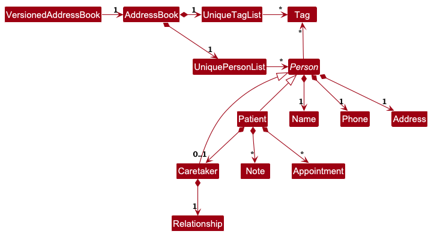

## **Acknowledgements**

No third party libraries were used in the development of MediSaveContact.

--------------------------------------------------------------------------------------------------------------------

## **Setting up, getting started**

Refer to the guide [_Setting up and getting started_](SettingUp.md).

--------------------------------------------------------------------------------------------------------------------

## **Design**

<div markdown="span" class="alert alert-primary">

:bulb: **Tip:** The `.puml` files used to create diagrams are in this document `docs/diagrams` folder. Refer to the [_PlantUML Tutorial_ at se-edu/guides](https://se-education.org/guides/tutorials/plantUml.html) to learn how to create and edit diagrams.
</div>

### Architecture


The ***Architecture Diagram*** given above explains the high-level design of the App.

Given below is a quick overview of main components and how they interact with each other.

**Main components of the architecture**

**`Main`** (consisting of classes [`Main`](https://github.com/se-edu/addressbook-level3/tree/master/src/main/java/seedu/address/Main.java) and [`MainApp`](https://github.com/se-edu/addressbook-level3/tree/master/src/main/java/seedu/address/MainApp.java)) is in charge of the app launch and shut down.
* At app launch, it initializes the other components in the correct sequence, and connects them up with each other.
* At shut down, it shuts down the other components and invokes cleanup methods where necessary.

The bulk of the app's work is done by the following four components:

* [**`UI`**](#ui-component): The UI of the App.
* [**`Logic`**](#logic-component): The command executor.
* [**`Model`**](#model-component): Holds the data of the App in memory.
* [**`Storage`**](#storage-component): Reads data from, and writes data to, the hard disk.

[**`Commons`**](#common-classes) represents a collection of classes used by multiple other components.

**How the architecture components interact with each other**

The *Sequence Diagram* below shows how the components interact with each other for the scenario where the user issues the command `deletepatient 1`.


Each of the four main components (also shown in the diagram above),

* defines its *API* in an `interface` with the same name as the Component.
* implements its functionality using a concrete `{Component Name}Manager` class (which follows the corresponding API `interface` mentioned in the previous point).

For example, the `Logic` component defines its API in the `Logic.java` interface and implements its functionality using the `LogicManager.java` class which follows the `Logic` interface. Other components interact with a given component through its interface rather than the concrete class (reason: to prevent outside component's being coupled to the implementation of a component), as illustrated in the (partial) class diagram below.


The sections below give more details of each component.

### UI component

The **API** of this component is specified in [`Ui.java`](https://github.com/se-edu/addressbook-level3/tree/master/src/main/java/seedu/address/ui/Ui.java)


The UI consists of a `MainWindow` that is made up of parts e.g.`CommandBox`, `ResultDisplay`, `PersonListPanel`, `StatusBarFooter` etc. All these, including the `MainWindow`, inherit from the abstract `UiPart` class which captures the commonalities between classes that represent parts of the visible GUI.

The `UI` component uses the JavaFx UI framework. The layout of these UI parts are defined in matching `.fxml` files that are in the `src/main/resources/view` folder. For example, the layout of the [`MainWindow`](https://github.com/se-edu/addressbook-level3/tree/master/src/main/java/seedu/address/ui/MainWindow.java) is specified in [`MainWindow.fxml`](https://github.com/se-edu/addressbook-level3/tree/master/src/main/resources/view/MainWindow.fxml)

The `UI` component,

* executes user commands using the `Logic` component.
* listens for changes to `Model` data so that the UI can be updated with the modified data.
* keeps a reference to the `Logic` component, because the `UI` relies on the `Logic` to execute commands.
* depends on some classes in the `Model` component, as it displays `Person` object residing in the `Model`.

### Logic component

**API** : [`Logic.java`](https://github.com/se-edu/addressbook-level3/tree/master/src/main/java/seedu/address/logic/Logic.java)

Here's a (partial) class diagram of the `Logic` component:


The sequence diagram below illustrates the interactions within the `Logic` component, taking `execute("deletepatient 1")` API call as an example.


<div markdown="span" class="alert alert-info">:information_source: **Note:** The lifeline for `DeleteCommandParser` should end at the destroy marker (X) but due to a limitation of PlantUML, the lifeline continues till the end of diagram.
</div>

How the `Logic` component works:

1. When `Logic` is called upon to execute a command, it is passed to an `AddressBookParser` object which in turn creates a parser that matches the command (e.g., `DeleteCommandParser`) and uses it to parse the command.
1. This results in a `Command` object (more precisely, an object of one of its subclasses e.g., `DeletePatientCommand`) which is executed by the `LogicManager`.
1. The command can communicate with the `Model` when it is executed (e.g. to delete a person).<br>
   Note that although this is shown as a single step in the diagram above (for simplicity), in the code it can take several interactions (between the command object and the `Model`) to achieve.
1. The result of the command execution is encapsulated as a `CommandResult` object which is returned back from `Logic`.

Here are the other classes in `Logic` (omitted from the class diagram above) that are used for parsing a user command:


How the parsing works:
* When called upon to parse a user command, the `AddressBookParser` class creates an `XYZCommandParser` (`XYZ` is a placeholder for the specific command name e.g., `AddCommandParser`) which uses the other classes shown above to parse the user command and create a `XYZCommand` object (e.g., `AddCommand`) which the `AddressBookParser` returns back as a `Command` object.
* All `XYZCommandParser` classes (e.g., `AddCommandParser`, `DeleteCommandParser`, ...) inherit from the `Parser` interface so that they can be treated similarly where possible e.g, during testing.

### Model component
**API** : [`Model.java`](https://github.com/se-edu/addressbook-level3/tree/master/src/main/java/seedu/address/model/Model.java)


The `Model` component

<div markdown="span" class="alert alert-info">
<br>

</div>

* stores the address book data i.e., all `Person` objects (which are contained in a `UniquePersonList` object).
* stores the currently 'selected' `Person` objects (e.g., results of a search query) as a separate _filtered_ list which is exposed to outsiders as an unmodifiable `ObservableList<Person>` that can be 'observed' e.g. the UI can be bound to this list so that the UI automatically updates when the data in the list change.
* stores a `UserPref` object that represents the user’s preferences. This is exposed to the outside as a `ReadOnlyUserPref` objects.
* maintains a `VersionedAddressBook` to support undo commands
  * `VersionAddressBook` keeps the current `AddressBook` observed by the UI
  *  On each command that mutates the database, `Model` will instruct `VersionedAddressBook` to snapshot the current state before executing command so `undo()` can revert to previous version
* does not depend on any of the other three components (as the `Model` represents data entities of the domain, they should make sense on their own without depending on other components)

The `Patient` class

* `Patient` extends from `Person`.
* `Patient` would have additional fields `Note` and `Appointment`.
* A `Patient` can have any number of `Note` and `Appointment`.
* `Patient` can have 0 or 1 number of `Caretaker`.

The `Caretaker` class
* `Caretaker` extends from `Person`.
* `Caretaker` must have 1 `Relationship`.

### Storage component

**API** : [`Storage.java`](https://github.com/se-edu/addressbook-level3/tree/master/src/main/java/seedu/address/storage/Storage.java)


The `Storage` component,
* can save both address book data and user preference data in JSON format, and read them back into corresponding objects.
* inherits from both `AddressBookStorage` and `UserPrefStorage`, which means it can be treated as either one (if only the functionality of only one is needed).
* depends on some classes in the `Model` component (because the `Storage` component's job is to save/retrieve objects that belong to the `Model`)

### Common classes

Classes used by multiple components are in the `seedu.address.commons` package.

--------------------------------------------------------------------------------------------------------------------

## **Implementation**

This section describes some noteworthy details on how certain features are implemented.

### Undo feature

#### Proposed Implementation

The proposed undo mechanism is facilitated by `VersionedAddressBook`. It wraps `AddressBook` with an undo history, stored internally as an internal stack of past states `historyLog`
and a pointer to the current state `current`. It provides the following operations:

* `VersionedAddressBook#update()` —  Saves the current address book state into the history as a new snapshot.
* `VersionedAddressBook#hasHistory()` —  Returns `true` if there is at least one previous snapshot of `AddressBook` to restore.
* `VersionedAddressBook#undo()` —  Restores the address book to a previous address book state from history
* `VersionedAddressBook#getAddressBook()` - Exposes live `AddressBook` instance that the UI is connected to

These operations are exposed in the `Model` interface
* Model operations that changes its content (e.g `addPerson`, `deletePerson`, `setPerson`, `clear`, `sortPersons`, etc.) calls `VersionedAddressBook#update()`
  to create a snapshot before applying the change
* Model#canUndo() calls `VersionedAddressBook#hasHistory()`
* Model#undo() calls `VersionedAddressBook#undo()` and passes the new filtered list to the UI `PREDICATE_SHOW_ALL_PERSONS` to refresh the UI list to show the
  list of patients in the latest snapshot of `AddressBook`

#### When we snapshot
Only mutating operations lead to snapshots. The `ModelManager` methods that mutate the book call `update()`, then pperform the change
* Mutating examples which captures snapshot: `add`, `delete`, `edit`, `clear`, `addappt`, `note`
* Non-mutating examples that does not capture snapshot: `list`, `find`, `help`, `sortappt`


#### Example Usage and Behaviour
Step 1: **Initial Launch**
`VersionedAddressBook` will have the initial `AddressBook` state as its `current` property (i.e `current` points to
the newly initialised `AddressBook`

Step 2: **User executes**
```
deletepatient 5
```

Inside `ModeManager.deletePerson()`:
1. `update()` snapshots the **pre-delete** state.
2. Deletes the 5th patient
3. Filtered list refreshes

Step 3: **User executes**
```
patient n/David p/98765432 a/Blk 312 tag/high
```

Inside `ModelManager.addPerson()`:
1. `update()` snapshots the **pre-add** state/
2. Adds the new patient.
3. Filtered list refreshes

New `AddressBook` snapshot is pushed to `historyLog`

Step 4: **User executes**
```undo```
1. `UndoCommand` checks `canUndo()`
2. `model.undo()` -> moves `current` pointer left by one, restores snapshot
   with `resetData(...)`
3. `updateFilteredPersonList(PREDICATE_SHOW_ALL_PERSONS)` clears any active filters, so full person UI is displayed

New `AddressBook` snapshot is pushed to `historyLog`


Step 5: **User executes**
```list```
```historyLog``` and ```current``` pointer unchanged. List continues to show all patients.

Step 6: **Behaviour summary**
* Mutating commands (`patient`, `deletepatient`, `edit`, `clear`, `appt`,
  `note`, `sort`) snapshot before changing data
* Undo reverts one step, restore state of latest snapshot captured in `historyLog`, and show all patients
* Non-mutating commands (`list`, `find`, `help`) does not affect content of historyLog.


#### Design considerations:

**Aspect: How undo executes:**

* **Alternative 1 (current choice):** Whole-book snapshots in the model
    * Pros:
        * Consistent design, snapshot timing centralized in `ModelManager`
        * Minimal coupling between commands and undo logic;
        * Easier to test
    * Cons:
        * For sessions with large history of commands, can be more memory-intensive

* **Alternative 2:** Command-specific inverse operations
    * Pros:
        * Lower memory (eg: deleted `Patient` for `deletepatient`), potentially faster performance sessions with large history of commands.
    * Cons:
        * Harder to implement, every mutating command require precise inverse behaviour upon redo
        * Greater risk of encountering bugs across commands
        * Harder to evolve as number of commands increase

Why we chose Alternative 1:
* It keeps our codebase easy to maintain as we add more mutating command. Every reversal follows a history log with minimal guesswork
  and edge cases, strengthening clarity and maintainability of system. We can introduce target optimisations, if memory scale becomes a concern later on


### Appointment feature

#### Overview
The appointment feature lets each `Patient` maintain a chronologically sorted list of upcoming visits. The workflow mirrors the undo/redo walkthrough above: start with a command issued at the CLI, flow through parsing, run model validations, and finally persist the state with undo support. Three commands participate:
* `appt` creates a new appointment for a patient.
* `editappt` updates an existing appointment.
* `deleteappt` removes an appointment.

Each command operates on the currently displayed list, reuses `Command#ensureValidPatientIndex(...)` for index safety, and surfaces results via `Messages.shortFormat(...)` so the UI stays consistent.


#### Example usage scenario
Step 1. The user runs `appt 3 d/31-12-2025 t/13:00 note/Year-end review`. `AddressBookParser` dispatches the command to `AddAppointmentCommandParser`, which validates the prefixes, parses the index, and builds the domain values (`Index`, `String` date/time, optional `Note`).

Step 2. `AddAppointmentCommand#execute(...)` retrieves patient 3 from the filtered list, instantiates a new `Appointment`, and delegates to `ModelManager#addAppointment(...)`.

Step 3. The model performs duplicate checks, creates an updated immutable patient via `Patient#addAppointment(...)`, and replaces the stored patient with `Model#setPerson(...)`. `VersionedAddressBook.update()` snapshots the pre-change state so undo continues to work (the behaviour mirrors the undo/redo diagrams above).

Step 4. The command formats feedback (`Appointment created: <formatted appointment>`) using the freshly constructed appointment rather than relying on list ordering, then returns the `CommandResult` to the UI.

`editappt` and `deleteappt` follow the same lifecycle: parse input, locate the patient, validate the target appointment, produce an updated `Patient` instance, and persist it through the model. Undoing any of these commands restores the previous snapshot just like the undo walkthrough earlier.

#### Command implementation notes
- `AddressBookParser` tokenises raw CLI input and dispatches to the relevant `*AppointmentCommandParser`. Each parser enforces mandatory prefixes, rejects duplicates via `ArgumentMultimap#verifyNoDuplicatePrefixesFor(...)`, and converts user input into domain objects with `ParserUtil`. Parse-time failures throw `ParseException`, surfacing format errors before model work begins.
- `AddAppointmentCommand` constructs the appointment immediately, which ensures invalid dates/times fail fast and allows the same instance to be reused in the success message.
- `EditAppointmentCommand` extends `AbstractEditCommand`. Its `EditAppointmentDescriptor` records only the mutated fields and provides `buildUpdatedAppointment(...)` to merge edits with the original appointment. `validateEdit(...)` performs type checks (patient vs. caretaker), ensures the appointment list is non-empty, and verifies the target index before any model mutation.
- `DeleteAppointmentCommand` extends `AbstractDeleteCommand`. After validation it copies the patient’s appointment list, removes the target entry, and delegates to the model to persist the updated patient.

#### Model updates and undo support
- `ModelManager#addAppointment(...)` is the entry point for creation. It guards against non-`Patient` targets, rebuilds the authoritative `Appointment`, and prevents double booking by comparing date/time pairs. Successful additions call `Patient#addAppointment(...)`, which returns a new immutable patient with a sorted appointment list, before handing control to `setPerson(...)`.
- Editing and deletion follow the same pattern by constructing new `Patient` instances with the edited or trimmed appointment lists. Because every mutation first invokes `VersionedAddressBook.update()`, undo/redo can revert or replay these operations without bespoke logic.
- `Patient` encapsulates appointment storage. Its mutators (`addAppointment`, `editAppointment`) copy the underlying list, apply the change, and sort the result, ensuring consumers never observe partially updated state.

#### Validation and error handling
- `Appointment` performs definitive validation: it parses `dd-MM-yyyy` and `HH:mm` values to `LocalDateTime` and rejects past timestamps via `MESSAGE_PAST_APPOINTMENT`. Optional notes are wrapped in `Note`, inheriting the same length and character checks as patient notes.
- Duplicate detection resides in the model layer rather than the parser so both CLI and future UI surfaces share the same safeguard. Attempts to schedule the same date/time for a patient trigger `MESSAGE_DUPLICATE_APPOINTMENT`.
- Editing supports note removal by treating empty `note/` inputs as `EditAppointmentDescriptor#clearNote()`. The descriptor tracks this through the `noteCleared` flag and `isAnyFieldEdited()` prevents no-op updates from reaching the model.

#### Testing guidance
- `AddAppointmentCommandTest`, `EditAppointmentCommandTest`, and `DeleteAppointmentCommandTest` cover the command flows, including duplicate detection, invalid indices, and success messaging.
- Parser-focused coverage in `AddAppointmentCommandParserTest`, `EditAppointmentCommandParserTest`, and `DeleteAppointmentCommandParserTest` verifies prefix handling, optional note parsing, and error reporting for malformed indices.
- `PatientTest` and `AppointmentTest` verify list immutability, chronological ordering, and validation logic so downstream commands can rely on the documented invariants.

#### Design considerations
**Aspect: Where to enforce appointment invariants**

* **Alternative 1 (current choice):** Validate in the model layer (`Appointment`, `ModelManager`).
   * Pros: Guarantees consistency for all entry points (CLI, potential GUI).
   * Cons: Commands need to surface validation errors up to the UI.
* **Alternative 2:** Validate in individual commands and parsers.
   * Pros: Simpler error messaging per command.
   * Cons: Tight coupling, duplicated checks, and increased risk when introducing new entry points.

All PlantUML sources are located alongside other diagrams in `docs/diagrams/` for future edits.


--------------------------------------------------------------------------------------------------------------------

## **Documentation, logging, testing, configuration, dev-ops**

* [Documentation guide](Documentation.md)
* [Testing guide](Testing.md)
* [Logging guide](Logging.md)
* [Configuration guide](Configuration.md)
* [DevOps guide](DevOps.md)

--------------------------------------------------------------------------------------------------------------------

## **Appendix: Requirements**

### Product scope

**Target user profile**:

* nurses who support patients outside of hospital settings
* juggle multiple patients, each with unique care needs
* rely on quick access to essential information
* can type fast
* prefers typing to mouse interactions
* is reasonably comfortable using CLI apps

**Value proposition**: manage patient records faster than a typical mouse/GUI driven app


### User stories

Priorities: High (must have) - `* * *`, Medium (nice to have) - `* *`, Low (unlikely to have) - `*`

| Priority | As a …​             | I want to …​                                         | So that I can…​                                         |
|----------|---------------------|------------------------------------------------------|---------------------------------------------------------|
| `* * *`  | home-visiting nurse | view the records without needing internet            | work at places with no cellular signal                  |
| `* * *`  | new user            | view all the commands of the MediSaveContact         | onboarding in the application is easy                   |
| `* * *`  | nurse               | add a new patient with personal details              | I can keep track of who I’m caring for                  |
| `* * *`  | nurse               | view a patient’s details quickly                     | I can recall important info during visits               |
| `* * *`  | nurse               | delete a patient’s record                            | I can remove patients I no longer manage                |
| `* * *`  | nurse               | list all patients                                    | I can get an overview of my caseload                    |
| `* * *`  | nurse               | add medical notes to a patient                       | I can record observations and treatment history         |
| `* * *`  | nurse               | add an appointment for a patient                     | I can remember when to visit them                       |
| `* *`    | nurse               | receive reminders for appointments                   | I won’t forget important visits                         |
| `* *`    | nurse               | filter patients by condition/notes                   | I can prioritize certain groups of patients             |
| `* *`    | nurse               | undo my last action                                  | I can recover from mistakes                             |
| `*`      | new user            | view detailed error message                          | I know if I am using the product wrongly and how to fix |
| `*`      | nurse               | update a patient's details                           | I can keep information accurate                         |
| `*`      | nurse               | search for a patient by name                         | I can find records quickly                              |
| `*`      | nurse               | view upcoming appointments                           | I can plan my schedule efficiently                      |
| `*`      | nurse               | delete an appointment                                | I can manage changes in patient schedules               |
| `*`      | nurse               | mark an appointment as completed                     | I can track which visits I've done                      |
| `*`      | nurse               | sort patients by name                                | I can find them more easily                             |
| `*`      | nurse               | add medication info to a patient                     | I can track prescriptions and dosages                   |
| `*`      | nurse               | view patients with ongoing medication                | I can check who needs regular follow-ups                |
| `*`      | nurse               | export patient records to a text file                | I can back up my data                                   |
| `*`      | nurse               | import patient records from a text file              | I can restore data if needed                            |
| `*`      | nurse               | tag patients with labels (e.g., "diabetes", "rehab") | I can organise them by health needs                     |
| `*`      | nurse               | search patients by tag                               | I can quickly find patients with similar conditions     |


### Use cases

(For all use cases below, the **System** is the `MediSaveContact` and the **Actor** is the `user`, unless specified otherwise)

**Use case 1: Delete a person**

**MSS**

1.  User requests to list persons
2.  MediSaveContact shows a list of persons
3.  User requests to delete a specific person in the list
4.  MediSaveContact deletes the person

    Use case ends.

**Extensions**

* 2a. The list is empty.

  Use case ends.

* 3a. The given index is invalid.

    * 3a1. MediSaveContact shows an error message.

      Use case resumes at step 2.

**Use case 2: Add an appointment to a patient**

**MSS**

1. User requests to list persons
2. MediSaveContact shows a list of persons
3. User requests to update a specific person's appointment
4. MediSaveContact updates the information

   Use case ends.

**Extensions**

* 2a. The list is empty.

  Use case ends.

* 3a. The given index is invalid.

    * 3a1. MediSaveContact shows an error message.

      Use case resumes at step 2.

* 3b. The given date is invalid.

    * 3b1. MediSaveContact shows an error message.

      Use case resumes at step 2.

**Use case 3: Add a medical note to a patient**

**MSS**

1. User requests to list persons
2. MediSaveContact shows a list of persons
3. User requests to update a specific person's medical note
4. MediSaveContact updates the information

   Use case ends.

**Extensions**

* 2a. The list is empty.

  Use case ends.

* 3a. The given index is invalid.

    * 3a1. MediSaveContact shows an error message.

      Use case resumes at step 2.

* 3b. The given note is empty.

    * 3b1. MediSaveContact shows an error message.

      Use case resumes at step 2.

* 3c. The given note is too long.

    * 3c1. MediSaveContact shows an error message.

      Use case resumes at step 2.

*{More to be added}*

### Non-Functional Requirements
#### Business
1. Single nurse profile can support <= 5000 patients
2. A nurse cannot create two appointments that overlap for the same patient
#### Constraints
1. Release is one JAR <= 100 MB, runs via java -jar
2. Features work 100% offline, no dependency on external servers
#### Performance
1. Listing up to 1000 patients render first screen in <300 ms and filter/search updates re-render in <150 ms
2. Prompt can be typed in <2.5s from java -jar
#### Quality
1. User can perform commands without using a mouse
2. Proper response to invalid commands (showing expected syntax, reason why commands are invalid, etc.)
#### Technical
1.  Should work on any _mainstream OS_ as long as it has Java `17` or above installed.
#### Process
1. Project to be conducted in Brownfield increments, by every week, a new release of the product is made available
#### Notes about project scope
1. The product should maintain a single local profile, no access to the same data file by another user

### Glossary


* **Mainstream OS**: Windows, Linux, Unix, macOS
* **JAR**: Java Archive -- A package file format used to aggregate many Java class files, associated metadata, and resources into a single file for distribution
* **GUI**: Graphical User Interface -- A form of user interface that allows users to interact with their devices through graphical icons and visual indicators
* **Patient records**: Information related to a patient (personal details, notes, appointments)
* **Medical note**: A string field with a maximum length of 200 characters, intended for storing patient specific notes such as diagnosis and medications
* **Appointment**: Patient's next appointment. Stores a DateTime object, and cannot be set to the past

--------------------------------------------------------------------------------------------------------------------

## **Appendix: Instructions for manual testing**

Given below are instructions to test the app manually. They cover the core MediSaveContact features and a handful of negative scenarios. After completing these scripts, continue with exploratory testing to uncover edge cases specific to your environment.

### Launch and shutdown

1. **Initial launch**
   1. Download the release JAR and place it in an empty folder (e.g. `~/medisavecontact-test`).
   2. Double-click (Windows) or run `java -jar medisavecontact.jar` (Linux/macOS).<br>
      **Expected:** The GUI opens with sample patients loaded. Status bar shows the data file path.
2. **Saving window preferences**
   1. Resize the window and drag it to a different monitor corner.
   2. Close the app using the window close button.
   3. Re-launch the app.<br>
      **Expected:** The remembered size and position are restored.
3. **Exit command**
   1. Enter `exit`.<br>
      **Expected:** Application shuts down cleanly with no lingering Java processes.

### Managing patients

1. **Adding a patient**
   1. Ensure the list view shows the full patient list via `list`.
   2. Execute `patient n/Lim Siew Mei p/93334444 a/88 Redhill Lane tag/high`.<br>
      **Expected:** Patient is appended to the list with the supplied details and `tag/HIGH`. Feedback panel confirms creation.
2. **Preventing duplicates**
   1. Repeat the exact command above.<br>
      **Expected:** Error message “This patient already exists in MediSaveContact.”
3. **Editing a patient**
   1. Run `editpatient INDEX p/98887777 tag/medium`, replacing `INDEX` with the position of the patient added earlier.<br>
      **Expected:** Phone number and tag update; other details remain unchanged.
   2. Run `editpatient INDEX` with no additional prefixes.<br>
      **Expected:** Error “At least one field to edit must be provided.”
4. **Deleting and clearing**
   1. Execute `deletepatient INDEX` on the same patient.<br>
      **Expected:** Patient disappears from the list; success message shows the removed details.
   2. Execute `deletepatient 0` and `deletepatient 999`.<br>
      **Expected:** Both fail with invalid index messages.
   3. (Optional) Run `clear` to wipe all data.<br>
      **Expected:** Patient list becomes empty. Restore data manually from a backup JSON file after this test.

### Managing caretakers

1. **Assigning a caretaker**
   1. With patients listed, pick one without a caretaker (or add a fresh patient).
   2. Execute `caretaker INDEX n/Lee Wei Jun p/90001234 a/Blk 22 Pasir Ris r/Brother`.<br>
      **Expected:** Patient card displays a caretaker section with the supplied details.
2. **Validation**
   1. Run `caretaker INDEX n/` with a blank name.<br>
      **Expected:** Validation error referencing the name constraint.
   2. Run `caretaker INDEX ...` on the same patient again.<br>
      **Expected:** Error stating the patient already has a caretaker.
3. **Editing and removing caretaker**
   1. Execute `editcaretaker INDEX p/98889999`.<br>
      **Expected:** Caretaker phone updates in the UI and success message.
   2. Execute `deletecaretaker INDEX`.<br>
      **Expected:** Caretaker section disappears. Running the command again should return an error indicating no caretaker exists.

### Managing notes

1. **Adding a note**
   1. Run `note INDEX note/Patient responded well to medication.`<br>
      **Expected:** Note appears under the patient with a green success message.
2. **Character limit enforcement**
   1. Attempt `note INDEX note/` followed by 250 characters.<br>
      **Expected:** Error “Note exceeds maximum length of 200 characters.”
   2. Execute `note INDEX note/   ` (whitespace only).<br>
      **Expected:** Error about blank notes.
3. **Editing and deleting notes**
   1. Run `editnote INDEX i/ITEM_INDEX note/Stable vitals recorded.`<br>
      **Expected:** Note content updates in place.
   2. Run `deletenote INDEX i/ITEM_INDEX`.<br>
      **Expected:** Note disappears; repeated deletion of the same `ITEM_INDEX` fails gracefully.

### Managing appointments

1. **Adding an appointment**
   1. Prepare a patient (INDEX) and run `appt INDEX d/01-12-2025 t/14:30 note/Follow-up blood test`.<br>
      **Expected:** Appointment list for the patient shows the new entry. Feedback confirms addition.
2. **Rejecting invalid dates/times**
   1. Run `appt INDEX d/01-01-2020 t/09:00` (past date).<br>
      **Expected:** Error describing date/time constraint.
   2. Run `appt INDEX d/40-13-2025 t/25:61`.<br>
      **Expected:** Parsing error for invalid date/time.
3. **Editing and deleting appointments**
   1. Add a second appointment, then run `editappt INDEX i/ITEM_INDEX t/16:00 note/Updated timing`.<br>
      **Expected:** Specified appointment updates the time and note.
   2. Execute `deleteappt INDEX i/ITEM_INDEX` on the updated appointment.<br>
      **Expected:** Appointment is removed. Trying to delete the same index again should fail if there are no more.

### Searching and filtering

1. Execute `find tan` after the sample data is restored.<br>
   **Expected:** Only patients whose names contain “tan” (case-insensitive) remain in the list, with indices renumbered.
2. Run `list`.<br>
   **Expected:** Full patient list is restored.
3. Combine with other commands: run `find high`, then try `deletepatient 1`.<br>
   **Expected:** Deletes the first patient in the filtered view; confirm via `list` that the correct patient was removed.

### Data persistence and autosave

1. Add a unique patient and caretaker as above.
2. Close the app using `exit`.
3. Reopen MediSaveContact.<br>
   **Expected:** The newly added patient and caretaker are still present, demonstrating autosave.
4. Navigate to `data/medisavecontact.json` and confirm the new patient entry exists in the JSON.

### Handling invalid commands

1. Enter a random string such as `foobar`.<br>
   **Expected:** Error “Unknown command” with a hint to use `help`.
2. Enter a valid command with missing prefixes, e.g. `patient John`.<br>
   **Expected:** Error message showing the correct usage format.
3. Enter extra prefixes for commands that should ignore them, e.g. `clear 123`.<br>
   **Expected:** Command succeeds and extraneous tokens are ignored.

### Recovering from corrupted storage files

1. Close the app. Open `data/medisavecontact.json` in a text editor.
2. Remove a closing brace or truncate the file intentionally.
3. Relaunch MediSaveContact.<br>
   **Expected:** Application starts with an empty data set and warns about the corrupted file.
4. Close the app, restore the JSON from a backup (or delete it to let the app regenerate sample data), then relaunch.<br>
   **Expected:** Normal startup with data restored.

### Resetting between test runs

* To return to the default sample data, delete `data/medisavecontact.json` before launching the application.
* Alternatively, keep a copy of a known-good JSON file and overwrite the data directory after each scenario.
