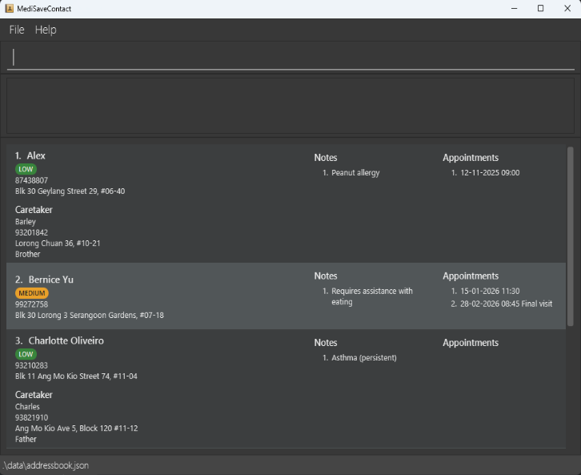
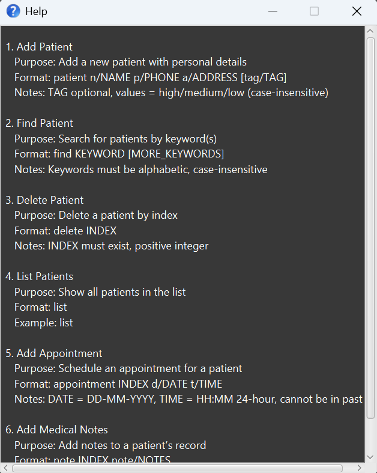

## Rationale

MediSaveContact is designed for nurses and healthcare workers who provide care outside traditional hospital settings.
The application focuses on quick data entry and retrieval through a command-line interface, making it faster to manage
patient information during busy schedules.

--------------------------------------------------------------------------------------------------------------------

## Quick start

1. Ensure you have Java 17 or above installed in your computer, following this [guide](https://se-education.org/guides/tutorials/javaInstallation.html).

1. Download the latest `.jar` file [here](https://github.com/AY2526S1-CS2103T-F14b-2/tp/releases).

1. Copy the file to the folder you want to use as the _home folder_ for your MediSaveContact.

1. For **Windows** users: Locate MediSaveContact in your file manager and double click on the application.<br>
   For **Mac/Linux** users: Open a command terminal, `cd` (change directory) into the folder you put the jar file in, and use the `java -jar MediSaveContact.jar` command to run the application.<br>
   An application similar to the one below should appear in a few seconds. Note how the app contains some sample data.<br>
    <br>

1. Type the command in the command box and press Enter to execute it. e.g. typing **`help`** and pressing Enter will open the help window.<br>
   Some example commands you can try:

    * `help` : Shows all commands available in the application.

   * `patient n/John Tan p/91234567 a/Blk 123 Clementi Ave 3 tag/high` : Adds a patient named `John Tan` to MediSaveContact.

   * `delete 3` : Deletes the 3rd contact shown in the current list.

   * `exit` : Exits the app.

1. Refer to the [Features](#features) below for details of each command.

--------------------------------------------------------------------------------------------------------------------

## Features

<div markdown="block" class="alert alert-info">

**:information_source: Notes about the command format:**<br>

* Words in `UPPER_CASE` are the parameters to be supplied by the user.<br>
  e.g. in `add n/NAME`, `NAME` is a parameter which can be used as `add n/John Doe`.

* Items in square brackets are optional.<br>
  e.g. `n/NAME [tag/TAG]` can be used as:
  * `n/John Doe tag/High` ✅
  * `n/John Doe` ✅

* Parameters can be in any order.<br>
  * `n/John Doe tag/high` ✅
  * `tag/high n/John Doe` ✅

* Extra parameters for commands that do not take in parameters (such as `help`, `list`, `exit` and `clear`) will be ignored.<br>
  e.g. if you type `list 123`, it will be interpreted as `list`.

* When a compulsory parameter is not provided, an error message regarding the missing parameter will appear, and the command will not be executed.

* If you are using a PDF version of this document, be careful when copying and pasting commands that span multiple lines as space characters surrounding line-breaks may be omitted when copied over to the application.
</div>

## Common Parameters Reference
{: #common-parameters }

Many commands share similar parameters with identical validation rules. Here are the common parameter types used throughout MediSaveContact:

### Index Parameter
{: #index-parameter }

<table>
  <thead>
    <tr>
      <th>Parameter</th>
      <th>Validation Rules</th>
      <th>Error Message if Invalid</th>
    </tr>
  </thead>
  <tbody>
    <tr>
      <td rowspan="2"><strong>INDEX</strong></td>
      <td>Must exist in patient list</td>
      <td>"The patient index provided is invalid. There are X patient(s)."</td>
    </tr>
    <tr>
      <td>Must be a positive integer </td>
      <td>"Invalid command format!"<br>[Command format shown]</td>
    </tr>
  </tbody>
</table>

**Usage**: Refers to the index number shown in the displayed patient list. Use the [`list`](#list-command) command to view all patient indices. `ITEM_INDEX` refers to the position of items within a patient's record (e.g., notes).

<div markdown="span" class="alert alert-primary">:bulb: **Tip:**
Patient indices adapt to the current view. If you use the `find` command to filter patients, the indices will be renumbered based on the filtered results (e.g., if only 3 patients match your search, they will be numbered 1, 2, 3 regardless of their original positions).
</div>

### Note Parameters
{: #note-parameters }

<table>
  <thead>
    <tr>
      <th>Parameter</th>
      <th>Validation Rules</th>
      <th>Error Message if Invalid</th>
    </tr>
  </thead>
  <tbody>
    <tr>
      <td rowspan="2"><strong>NOTE</strong></td>
      <td>Max 200 characters</td>
      <td>"Note exceeds maximum length of 200 characters."</td>
    </tr>
    <tr>
      <td>Cannot be empty or whitespace only</td>
      <td>"Notes can take any values, and it should not be blank"</td>
    </tr>
  </tbody>
</table>

**Usage**: `NOTE` refers to text content for patient notes with length and content validation.


### Person Information Parameters
{: #person-info-parameters }

<table>
  <thead>
    <tr>
      <th>Parameter</th>
      <th>Validation Rules</th>
      <th>Error Message if Invalid</th>
    </tr>
  </thead>
  <tbody>
    <tr>
      <td rowspan="2"><strong>NAME</strong></td>
      <td>Cannot be blank</td>
      <td>"Name cannot be blank."</td>
    </tr>
    <tr>
      <td>Must contain valid characters only (letters, hyphens, apostrophes, commas)</td>
      <td>"Name contains invalid characters. Only letters, hyphen(-), apostrophe (/) and comma(,) are allowed."</td>
    </tr>
    <tr>
      <td rowspan="3"><strong>PHONE</strong></td>
      <td>Cannot be blank</td>
      <td>"Phone number cannot be blank."</td>
    </tr>
    <tr>
      <td>Must contain digits only</td>
      <td>"Phone number must contain digits only."</td>
    </tr>
    <tr>
      <td>Must be between 3 and 15 digits</td>
      <td>"Phone number must be between 3 and 15 digits."</td>
    </tr>
  </tbody>
</table>

**Usage**: Core person information fields (name, phone) shared by patients and caretakers.

## Command summary

Action | Description
--------|------------------
**patient** | Adds a patient to MediSaveContact
**clear** | Deletes all patients from MediSaveContact
**deletepatient** | Deletes specified patient from MediSaveContact
**editpatient** | Edits specified patient's details
**find** | Finds patient(s) with name containing specified keyword
**appointment** | Adds an appointment to specified patient
**note** | Adds a note to specified patient
**editnote** | Edits an existing note of a specified patient
**deletenote** | Deletes a note from a specified patient
**list** | Shows a list of all patients in MediSaveContact
**help** | Shows all commands available

### Viewing help : `help`

Shows all commands available in the application.

#### Command Format:
```
help
```

#### Outputs
- Success: A pop-up box like the one below would appear, listing the commands available, and how to use them.



- Failure: Help command would never result in failure

### Listing all patients : `list`
{: #list-command }
Shows a list of all patients in MediSaveContact, even if it is empty.

#### Command Format:

`list [tag/TAG]`

#### Example Commands:
```
list
```
```
list tag/high
```

#### Parameters & Validation Rules
<table>
    <thead>
        <tr>
        <th>Parameter</th>
        <th>Validation Rules</th>
        <th>Error Message if Invalid </th>
        </tr>
    </thead>
    <tbody>
        <tr>
          <td>TAG</td>
          <td>Must be low, medium and high only (case-insensitive)</td>
          <td>"Invalid value. Only 'high', 'medium', or 'low' are allowed."</td>
        </tr>
    </tbody>
</table>

#### Outputs

- Success: "Listed all patients" / "Listed all patients with Tag: HIGH"
- Failure: Error messages above

### Adding a patient: `patient`

Adds a patient to MediSaveContact.

#### Command Format:

`patient n/NAME p/PHONE_NUMBER a/ADDRESS [tag/TAG]`

#### Example Commands:
```
patient n/John Tan p/91234567 a/Blk 123 Clementi Ave 3 tag/high
```
```
patient n/Amy Lee p/82345678 a/456 Bedok North Street 2 tag/medium
```

#### Parameters & Validation Rules
<table>
    <thead>
        <tr>
        <th>Parameter</th>
        <th>Validation Rules</th>
        <th>Error Message if Invalid </th>
        </tr>
    </thead>
    <tbody>
        <tr>
          <td><strong>NAME</strong></td>
          <td colspan="2">See <a href="#person-info-parameters">Person Information Parameters</a></td>
        </tr>
        <tr>
          <td><strong>PHONE</strong></td>
          <td colspan="2">See <a href="#person-info-parameters">Person Information Parameters</a></td>
        </tr>
        <tr>
          <td><strong>ADDRESS</strong></td>
          <td>Cannot be blank</td>
          <td>"Address cannot be blank."</td>
        </tr>
        <tr>
          <td rowspan="2"><strong>TAG</strong> (Optional)</td>
          <td>Must be 'low', 'medium', or 'high' only (case-insensitive)</td>
          <td>"Invalid tag. Only 'high', 'medium', or 'low' are allowed"</td>
        </tr>
        <tr>
          <td>Can be empty to remove tag</td>
          <td>N/A</td>
        </tr>
    </tbody>
</table>

#### Outputs

- Success:
  - In GUI: New Patient appears in Patient list
  - In Command Feedback Box: <br>"Patient created: [Name]; Phone: [Phone]; Address: [Address]; Tag: [Tag]"
- Failure: Error Messages above

<div markdown="span" class="alert alert-primary">:bulb: **Tip:**
Patient's name is auto capitalised (Eg: John doe will be saved as John Doe)
</div>

<div markdown="span" class="alert alert-warning">:exclamation: **Warning:**
Patients are duplicates if both name and phone number match (case-insensitive). If attempting to add a duplicate patient, you will see the error: "This patient already exists in MediSaveContact"
</div>


### Editing a patient : `editpatient`

Edits an existing patient in MediSaveContact.

#### Command Format:

`editpatient INDEX [n/NAME] [p/PHONE] [a/ADDRESS] [tag/TAG]`

#### Example Commands :
```
editpatient 1 p/91234567
```
```
editpatient 2 n/Betsy Crower tag/
```

#### Parameters & Validation Rules

<table>
  <thead>
    <tr>
      <th>Parameter</th>
      <th>Validation Rules</th>
      <th>Error Message if Invalid</th>
    </tr>
  </thead>
  <tbody>
    <tr>
      <td><strong>INDEX</strong></td>
      <td colspan="2">See <a href="#index-parameter">INDEX Parameter</a></td>
    </tr>
    <tr>
      <td rowspan="2"><strong>NAME / PHONE / ADDRESS / TAG</strong></td>
      <td>At least one of these parameters must be present</td>
      <td>"At least one field to edit must be provided."</td>
    </tr>
    <tr>
      <td colspan="2">See <a href="#adding-a-patient-patient">patient command</a> for individual parameter validation rules and error messages</td>
    </tr>
  </tbody>
</table>

#### Outputs

- Success:
  - In Command Feedback Box: <br>"Patient edited: [changed fields]<br>For [Name]; Phone: [Phone]"
- Failure: Error messages above

<div markdown="span" class="alert alert-primary">:bulb: **Tip:**
You can remove all the person’s tags by typing `tag/` without
    specifying any tags after it.
</div>

### Deleting a patient: `deletepatient`

Deletes a patient at a specified index from the address book.
The index refers to the index number shown in the displayed person list.


#### Command Format:

`deletepatient INDEX`

#### Example Commands:

```
deletepatient 1
```

#### Parameters & Validation Rules

<table>
  <thead>
    <tr>
      <th>Parameter</th>
      <th>Validation Rules</th>
      <th>Error Message if Invalid </th>
    </tr>
  </thead>
  <tbody>
    <tr>
      <td><strong>INDEX</strong></td>
      <td colspan="2">See <a href="#index-parameter">INDEX Parameter</a></td>
    </tr>
  </tbody>
</table>

#### Outputs

- Success:
  - In GUI: Patient removed from Patient list
  - In Command Feedback Box: "Patient [Name]; Phone: [Phone] deleted."
- Failure: Error messages above

<div markdown="span" class="alert alert-primary">:bulb: **Tip:**
Run [list](#list-command) command to view the respective index for each patient.
</div>

### Adding a note : `note`

Adds a note to a patient's record for tracking medical observations, treatment updates, or other important information.

#### Command Format:

`note INDEX note/NOTE`

Example Commands :
```
note 1 note/Patient shows improved blood sugar levels today.
```
```
note 3 note/Allergic reaction to penicillin - avoid in future treatments
```

#### Parameters & Validation Rules

<table>
  <thead>
    <tr>
      <th>Parameter</th>
      <th>Validation Rules</th>
      <th>Error Message if Invalid </th>
    </tr>
  </thead>
  <tbody>
    <tr>
      <td><strong>INDEX</strong></td>
      <td colspan="2">See <a href="#index-parameter">INDEX Parameter</a></td>
    </tr>
    <tr>
      <td><strong>NOTE</strong></td>
      <td colspan="2">See <a href="#note-parameters">Note Parameters</a></td>
    </tr>
  </tbody>
</table>

#### Outputs

- Success:
  - In GUI: Note created in specified patient
  - In Command Feedback Box: <br>"Note added: [Content]<br>For [Name]; Phone: [Phone]"

- Failure: Error messages above


<div markdown="span" class="alert alert-primary">:bulb: **Tip:**
Notes are appended to existing notes, so you can add multiple notes to build a complete medical history for each patient.
</div>

### Editing a note : `editnote`

Edits an existing note in a patient's record. This allows you to update medical observations, correct information, or modify treatment notes.

#### Command Format:

`editnote INDEX i/ITEM_INDEX note/NOTE`

#### Example Commands:
```
editnote 1 i/2 note/Patient shows significant improvement in blood sugar levels.
```
```
editnote 3 i/1 note/Updated: No allergic reaction to penicillin observed during treatment.
```

#### Parameters & Validation Rules

<table>
  <thead>
    <tr>
      <th>Parameter</th>
      <th>Validation Rules</th>
      <th>Error Message if Invalid </th>
    </tr>
  </thead>
  <tbody>
    <tr>
      <td><strong>INDEX</strong></td>
      <td colspan="2">See <a href="#index-parameter">INDEX Parameter</a></td>
    </tr>
    <tr>
      <td rowspan="2"><strong>ITEM_INDEX</strong></td>
      <td>Must be a positive integer</td>
      <td>"Invalid command format!"<br>[Command format shown]</td>
    </tr>
    <tr>
      <td>Must correspond to an existing note</td>
      <td>"The note at index X is invalid. Patient has Y note(s)."</td>
    </tr>
    <tr>
      <td><strong>NOTE</strong></td>
      <td colspan="2">See <a href="#note-parameters">Note Parameters</a></td>
    </tr>
  </tbody>
</table>

#### Outputs

- Success:
  - In GUI: Note updated in specified patient
  - In Command Feedback Box: <br>"Note [Index] edited: [Content]<br>For [Name]; Phone: [Phone]"

- Failure: Error messages above


### Deleting a note : `deletenote`

Deletes a specific note from a patient's record. This permanently removes the note from the patient's medical history.

#### Command Format:

`deletenote INDEX i/ITEM_INDEX`

#### Example Commands:
```
deletenote 1 i/2
```
```
deletenote 3 i/1
```

#### Parameters & Validation Rules

<table>
  <thead>
    <tr>
      <th>Parameter</th>
      <th>Validation Rules</th>
      <th>Error Message if Invalid </th>
    </tr>
  </thead>
  <tbody>
    <tr>
      <td><strong>INDEX</strong></td>
      <td colspan="2">See <a href="#index-parameter">INDEX Parameter</a></td>
    </tr>
    <tr>
      <td><strong>ITEM_INDEX</strong></td>
      <td colspan="2">See <a href="#editing-a-note--editnote">editnote command</a></td>
    </tr>
  </tbody>
</table>

#### Outputs

- Success:
  - In GUI: Note removed from specified patient
  - In Command Feedback Box: <br>"Note [Index] deleted.<br>For [Name]; Phone: [Phone]"

- Failure: Error messages above


### Adding an appointment : `appointment`

Schedule an appointment for a patient using a specified index.

#### Command Format:

`appointment INDEX d/DATE t/TIME [note/APPT_DESCRIPTION]`

#### Example Commands:

```
appointment 1 d/15-11-2026 t/20:03
```

#### Parameters & Validation Rules

<table>
  <thead>
    <tr>
      <th>Parameter</th>
      <th>Validation Rules</th>
      <th>Error Message if Invalid </th>
    </tr>
  </thead>
  <tbody>
    <tr>
      <td><strong>INDEX</strong></td>
      <td colspan="2">See <a href="#index-parameter">INDEX Parameter</a></td>
    </tr>
    <tr>
      <td rowspan="2"><strong>DATE</strong></td>
      <td>Must follow DD-MM-YYYY format</td>
      <td>"Invalid date. Must follow DD-MM-YYYY format!"</td>
    </tr>
    <tr>
      <td>Must be today or later</td>
      <td>"Appointment cannot be set in the past!"</td>
    </tr>
    <tr>
      <td rowspan="2">TIME</td>
      <td>	Must follow HH:MM 24-hour format</td>
      <td>“Invalid time. Must follow HH:MM 24-hour format!”</td>
    </tr>
    <tr>
      <td>If the appointment is today, time must be later than the current time</td>
      <td>"Appointment cannot be set in the past!"</td>
    </tr>
    <tr>
      <td><strong>NOTE</strong> (Optional)</td>
      <td colspan="2">See <a href="#note-parameters">Note Parameters</a></td>
    </tr>
  </tbody>
</table>

#### Outputs

- Success:
  - In GUI: Appointment created in specified patient
  - In Command Feedback Box: <br>"Appointment created: [Date]; [Time]; Note: [Note]<br>For [Name]; Phone: [Phone]"
- Failure: Error Messages above

### Sorting appointments by time: `sortappt`
Sorts the current list of patients in MediSaveContact by their soonest upcoming appointment (earliest first).
Patients without appointments are placed after those with appointment.
#### Command Format:
```
sortappt
```

#### Outputs:
- Success: "Patients sorted by earliest appointment!"
- Failure:
  - If no patients: "There are no patients in MediSaveBook to sort!"
  - If all patients have no appointment: "No appointments to sort!"


### Locating patients by name : `find`

Finds patients whose names contain any of the given keywords.

#### Command Format:

`find KEYWORD [MORE_KEYWORDS]`

#### Example Commands:
```
find Alex
```
returns `Alex` and `Bernice Yu Alex`

```
find charlotte david
```
returns `Charlotte Oliveiro` and `David Li`<br>

#### Parameters & Validation Rules

| Parameter               | Validation Rules                   | Error Message if Invalid                                                                                                                                                                                                                                                |
|-------------------------|------------------------------------|-------------------------------------------------------------------------------------------------------------------------------------------------------------------------------------------------------------------------------------------------------------------------|
| KEYWORD & MORE_KEYWORDS | Must be a string of alphabets only | "Invalid command format!"<br>[Command format shown] |

* The search is case-insensitive. e.g `hans` will match `Hans`
* The order of the keywords does not matter. e.g. `Hans Bo` will match `Bo Hans`
* Only the name is searched.
* Only full words will be matched e.g. `Han` will not match `Hans`
* Persons matching at least one keyword will be returned (i.e. `OR` search).
  e.g. `Hans Bo` will return `Hans Gruber`, `Bo Yang`
* Find only searches for patient names, not caretaker names.

#### Outputs
- Success: "X persons listed!", where X is the number of matching persons
- Failure: Error messages above

<div markdown="span" class="alert alert-primary">:bulb: **Tip:**
Indexes of commands are based on the updated list after using Find. To restore the original list, consider using the List command!
</div>

### Undoing a previous command: `undo` 
Undoes the effect of the most recent **successful** command, provided there was already a
successful command given. This only works for commands which changes the database.

Command Format:
```
undo
```

#### Outputs
- Success: "Previous command undone."
- Failure: "No record of successful commands to undo."

### Navigating through command history: `↑ / ↓`
Use arrow keys to cycle through command history.

**Legend**:
- Up Arrow Key ↑
- Down Arrow Key ↓

**How It Works**
- Press ↑ to move backwards through command history
- Press ↓ to move forward through command history
<div markdown="span" class="alert alert-primary">:bulb: **Tip:**
Commands are only added if they are successful.
</div>


### Clearing all entries : `clear`

Clears all entries from MediSaveContact.

#### Command Format:
```
clear
```

### Exiting the program : `exit`

Exits the program.

Command Format:
```
exit
```

### Saving the data

MediSaveContact data are saved in the hard disk automatically after any command that changes the data. There is no need to save manually.

### Editing the data file

MediSaveContact data are saved automatically as a JSON file `[JAR file location]/data/addressbook.json`. Advanced users are welcome to update data directly by editing that data file.

<div markdown="span" class="alert alert-warning">:exclamation: **Caution:**
If your changes to the data file makes its format invalid, MediSaveContact will discard all data and start with an empty data file at the next run. Hence, it is recommended to take a backup of the file before editing it.<br>
Furthermore, certain edits can cause the application to behave in unexpected ways (e.g., if a value entered is outside of the acceptable range). Therefore, edit the data file only if you are confident that you can update it correctly.
</div>


--------------------------------------------------------------------------------------------------------------------

## FAQ

**Q**: How do I transfer my data to another Computer?<br>
**A**: Install the app in the other computer and overwrite the data file it creates with the file that contains the data of your previous MediSaveContact home folder.

--------------------------------------------------------------------------------------------------------------------

## Known issues

1. **When using multiple screens**, if you move the application to a secondary screen, and later switch to using only the primary screen, the GUI will open off-screen. The remedy is to delete the `preferences.json` file created by the application before running the application again.
2. **If you minimize the Help Window** and then run the `help` command (or use the `Help` menu, or the keyboard shortcut `F1`) again, the original Help Window will remain minimized, and no new Help Window will appear. The remedy is to manually restore the minimized Help Window.
